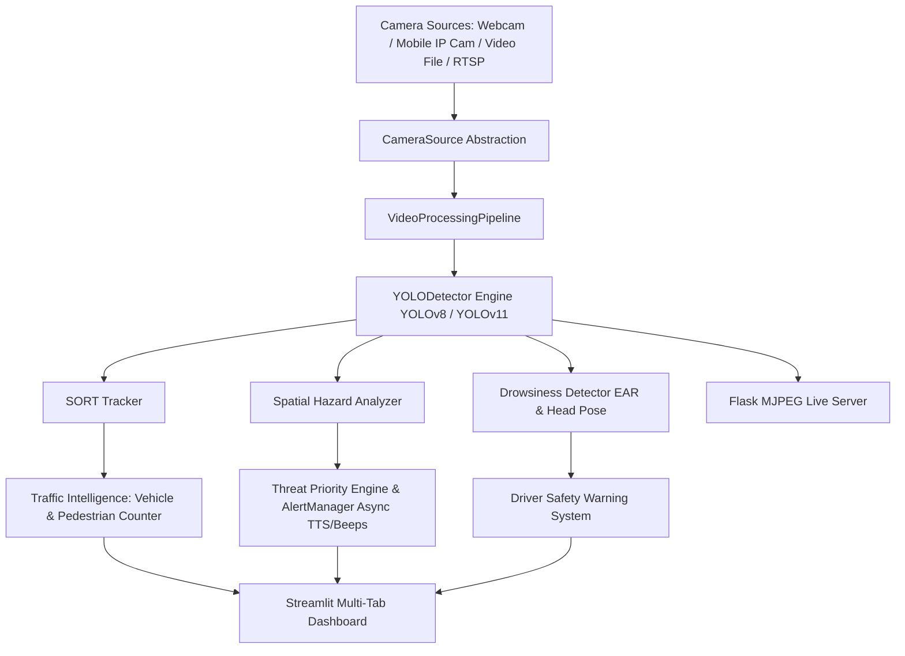

# VisionGuard AI — System Architecture & Design

VisionGuard AI is designed as a modular, layered Computer Vision and Intelligent Safety Platform.

## Layered Subsystems

### 1. Core Layer (`visionguard.core`)
* **`device.py`**: Automatic hardware detection (CUDA GPU or CPU fallback).
* **`camera.py`**: Unified video capture interface with auto-reconnect handling.
* **`detector.py`**: Singleton-cached YOLO model wrapper producing standardized `DetectionResult` objects.
* **`pipeline.py`**: High-performance video processing pipeline with FPS and latency measurement.

### 2. Tracking Subsystem (`visionguard.tracking`)
* **`sort_tracker.py`**: Refactored SORT (Simple Online and Realtime Tracking) implementation using Kalman Filters and Hungarian bounding box assignment.

### 3. Assistive AI Subsystem (`visionguard.assistive`)
* **`spatial_analyzer.py`**: Evaluates 3D-like spatial threat zones (Head-level top zone, vehicle proximity limit, animal path blocks).
* **`priority_engine.py`**: Rate-limits, filters, and prioritizes urgent hazards.
* **`alert_manager.py`**: Non-blocking thread worker managing `pyttsx3` text-to-speech queues and `winsound`/cross-platform audio beeps.

### 4. Traffic Subsystem (`visionguard.traffic`)
* **`vehicle_counter.py`**: Line-crossing vehicle counting and classification (cars, trucks, buses, motorbikes).
* **`people_counter.py`**: Directional pedestrian flow counter (Up/Down or In/Out).
* **`analytics.py`**: Aggregates traffic statistics and timelines.

### 5. Driver Safety Subsystem (`visionguard.drowsiness`)
* **`ear.py`**: Eye Aspect Ratio (EAR) & PERCLOS rolling window tracker.
* **`head_pose.py`**: Head posture vertical displacement tilt tracker.
* **`detector.py`**: Driver drowsiness state machine (`NORMAL`, `WARNING`, `DROWSY`, `SEVERE`).

### 6. Services & Interfaces (`visionguard.services` & `visionguard.apps`)
* **`weather.py`**: Asynchronous background thread OpenWeather API client.
* **`dashboard.py`**: Unified multi-tab Streamlit dashboard.
* **`server.py`**: Lightweight Flask MJPEG video streaming server.
